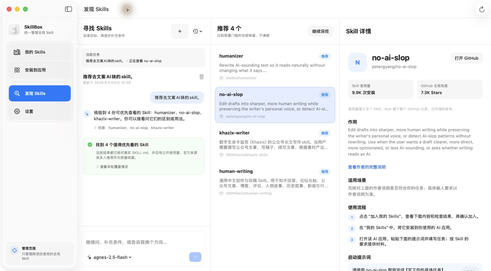

<div align="center">
  

  # SkillBox

  **把散落在不同 AI 应用里的 Skills，放回一个看得见、管得住的地方。**

  本地优先 · 安装前预览 · 操作可撤销 · 无账号 · 无遥测

  [下载 v0.2.3](https://github.com/AidenXu-1/SkillBox/releases/tag/v0.2.3) · [反馈问题](https://github.com/AidenXu-1/SkillBox/issues)
</div>

## SkillBox 能做什么

SkillBox 是一款面向 AI 产品创作者的原生 macOS 应用。你可以从本地开发文件夹或 GitHub 添加全局 Skill，再把同一份版本安装到多个 AI 应用。

- **我的 Skills**：查看每份 Skill 的唯一来源、文件内容、风险提示和已安装应用。
- **安装到应用**：集中选择安装位置，安装、更新和卸载前先预览变化；已有同名内容或外部改动会明确提示。
- **操作恢复**：写入后保留操作记录与恢复点，可撤销安装、更新和卸载；恢复时保护后来修改过的文件。
- **发现 Skills**：输入具体名称、GitHub 地址或想完成的任务，从公开来源寻找并核对真实 `SKILL.md`；可以继续补充条件、比较和了解候选。
- **跟踪来源**：支持本地开发文件夹、GitHub 正式 Release 或默认分支；检查到变化后，由你确认更新和安装。本地开发文件夹始终只读。
- **可选 AI**：使用自己的 API Key 辅助理解需求和候选；“我的 Skills”中的 Skill 介绍由你主动点击后通过 Agnes 生成。
- **本地优先**：无需 SkillBox 账号，无遥测、无云端 Skill 库；关闭 AI 后，核心添加、安装、更新、卸载和恢复仍可使用。

SkillBox 管理的是跨项目使用的全局 Skills，不扫描或管理项目级 Skills。发现结果取决于可访问的公开来源与核验情况，未完成的来源会如实显示；加入候选前还会进行完整的本地安全检查。



## 下载与安装

当前发行版本：**v0.2.3（Build 7）**。

[**下载 v0.2.3 安装包**](https://github.com/AidenXu-1/SkillBox/releases/tag/v0.2.3) · [历史版本](https://github.com/AidenXu-1/SkillBox/releases)

系统要求：Apple Silicon Mac，macOS 15.0 或更高版本。

1. 打开上方下载页，下载并打开 `SkillBox-0.2.3.dmg`。
2. 把 SkillBox 拖进「应用程序」。
3. 第一次打开时，如果 macOS 提示无法验证开发者，请进入「系统设置 → 隐私与安全」。
4. 找到 SkillBox，点击「仍要打开」，按系统提示输入这台 Mac 的登录密码。

> SkillBox 当前采用 ad-hoc 签名并启用 Hardened Runtime，没有使用 Apple Developer ID，也没有经过 Apple 公证。macOS 无法通过 Apple 证书确认开发者身份，首次打开需要你亲自放行；应用更新后，系统可能再次要求确认。请从项目官方 GitHub 下载。

本版本已完成现有安装环境中的核心流程验收；另一台 Mac 或干净账户的首次安装、手动放行与核心操作体验尚未单独实测。此限制也记录在版本说明中。

## 隐私与安全

- 默认在本机保存和处理 Skill 内容。
- 扫描、导入和检查阶段不会执行 Skill 中的脚本。
- API Key 只保存到 macOS 钥匙串，不写入设置文件。
- 公开 GitHub 来源可在应用打开期间检查版本；下载、更新和安装由你确认。私人仓库需要你明确授权。
- AI 仅在你主动发起相关操作后使用所配置服务，不随应用启动或切换 Skill 自动生成介绍；API 费用按服务商规则计算。
- 安装、覆盖、更新、卸载等文件操作均需用户确认，并保留恢复点。

同一发行版本会附带 DMG、`.sha256` 校验文件和 `-release.json` 来源清单。可用 `shasum -a 256` 计算下载文件的摘要，与同版本校验文件核对。

## 已支持的 AI 应用

新用户默认显示 GPT（Codex）、Claude（Claude Code）、WorkBuddy、ZCode、Kimi Code、Cursor、HanaAgent、Pi、DeepSeek Harness 和 Trae。每列显示对应应用在本机的实际可用状态。

可以移出或恢复应用列，也可以添加自定义全局 Skills 目录。老用户已有的 Gemini CLI、OpenCode 目标和安装关系继续保留。

## 开发与验证

项目使用 SwiftUI 和 Swift Package Manager，核心数据与文件操作均有自动化测试保护。

```bash
cd app
./Scripts/test-all.sh
./Scripts/package-app.sh release
```

准备发行候选可运行 `app/Scripts/release-distribution.sh`（从仓库根目录执行）。脚本会发现并执行全量测试，完成 Release 构建、签名、图标与隐私检查，生成 DMG、SHA-256 和来源清单，并模拟下载后的隔离属性；它不会自动安装或上传 GitHub。

测试数量和结果以当次执行为准。默认发行检查还包括真实主流程、干净账户安装体验，以及发布后下载附件的校验；v0.2.3 在已披露首次安装未实测的范围下获准发布，未将该项记为通过。

开发说明：[`docs/spec.md`](docs/spec.md) · [`docs/agent-guide.md`](docs/agent-guide.md) · [`docs/progress.md`](docs/progress.md) · [`app/README.md`](app/README.md)
