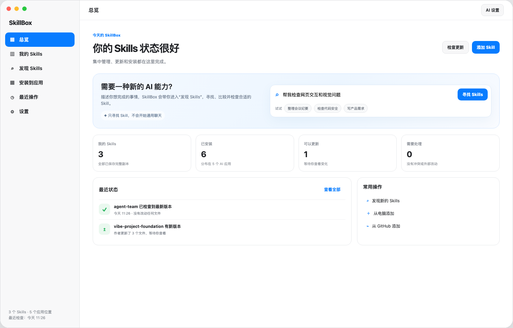
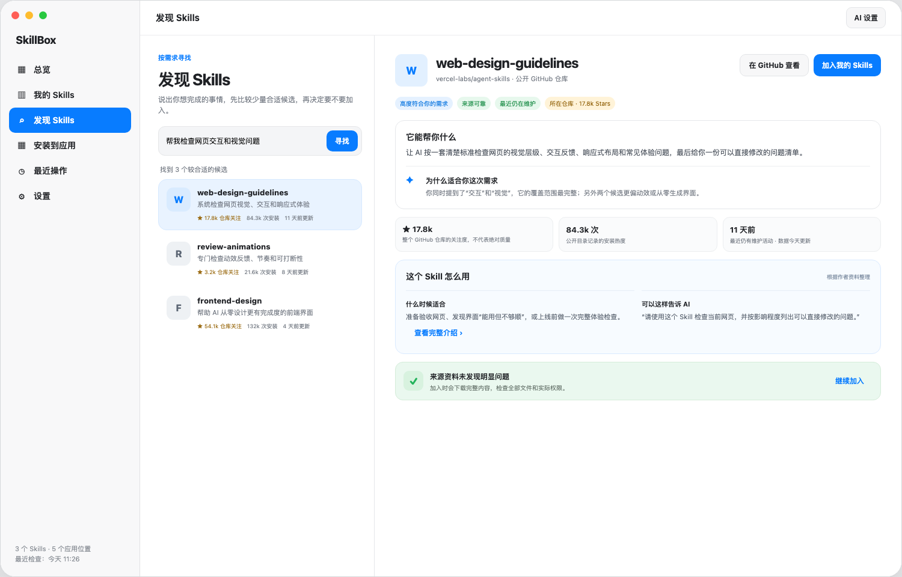
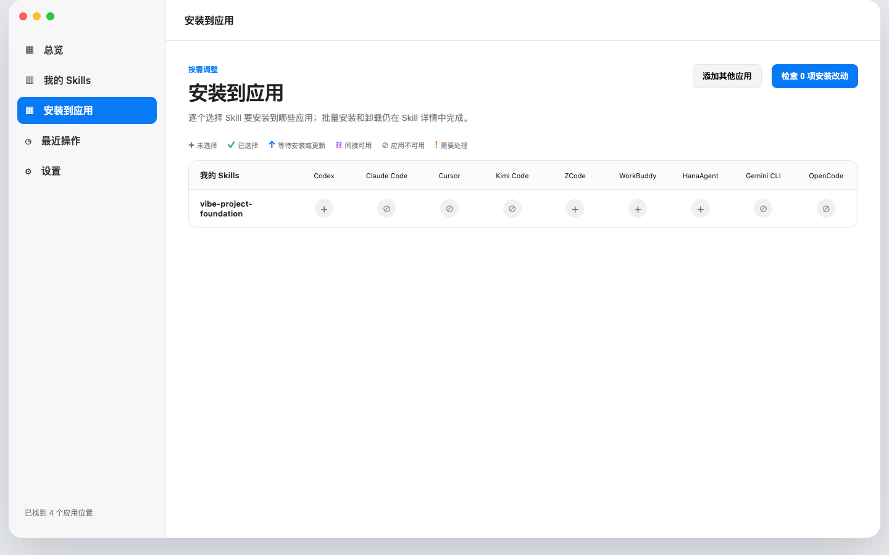

<div align="center">
  

  # SkillBox

  **把散落在不同 AI 应用里的 Skills，放回一个看得见、管得住的地方。**

  本地优先 · 安装前预览 · 操作可撤销 · 无账号 · 无遥测

  [下载最新版](https://github.com/AidenXu-1/SkillBox/releases/latest/download/SkillBox-0.2.0.dmg) · [查看版本说明](https://github.com/AidenXu-1/SkillBox/releases/latest) · [反馈问题](https://github.com/AidenXu-1/SkillBox/issues)
</div>



## SkillBox 能做什么

SkillBox 是一款面向 AI 产品创作者的原生 macOS 应用。它会先只读盘点电脑里的 Skills，再由你决定哪些内容进入「我的 Skills」，以及安装到哪些 AI 应用。

- **统一管理**：集中查看 Skill 原件、重复副本、不同版本与安装状态。
- **安全安装**：写入前展示变化，不静默覆盖已有文件。
- **随时撤销**：安装、更新和卸载都有操作记录，可以恢复到操作前。
- **发现 Skills**：用普通语言描述需求，从公开来源寻找并核对真实 `SKILL.md`。
- **跟踪更新**：支持 GitHub Release、默认分支和本地开发源，更新始终由你确认。
- **本地优先**：无需 SkillBox 账号，没有遥测，也没有云端数据库。

<table>
  <tr>
    <td width="50%"></td>
    <td width="50%"></td>
  </tr>
  <tr>
    <td align="center">按实际需求发现 Skill</td>
    <td align="center">看清每个应用的安装状态</td>
  </tr>
</table>

## 下载与安装

当前版本：**v0.2.0（Build 3）**

[**下载 SkillBox-0.2.0.dmg**](https://github.com/AidenXu-1/SkillBox/releases/latest/download/SkillBox-0.2.0.dmg)

系统要求：Apple Silicon Mac，macOS 15.0 或更高版本。

1. 下载并打开 DMG。
2. 把 SkillBox 拖进「应用程序」。
3. 第一次打开时，如果 macOS 提示无法验证开发者，请进入「系统设置 → 隐私与安全」。
4. 找到 SkillBox，点击「仍要打开」，再按系统提示确认一次。

> SkillBox 当前没有使用 Apple Developer ID，也没有经过 Apple 公证。这不会绕过 macOS 的安全机制，因此首次打开需要你亲自放行；应用更新后，系统可能再次要求确认。

## 隐私与安全

- 默认在本机保存和处理 Skill 内容。
- 扫描、导入和检查阶段不会执行 Skill 中的脚本。
- API Key 只保存到 macOS 钥匙串，不写入设置文件。
- 私人 GitHub 仓库和 AI 服务仅在用户主动连接、主动触发时访问。
- 安装、覆盖、更新、卸载等文件操作均需用户确认，并保留恢复点。

你可以使用发布页附带的 SHA-256 文件验证下载完整性：

```bash
shasum -a 256 SkillBox-0.2.0.dmg
```

正确校验值请以同一 Release 附带的 `SkillBox-0.2.0.sha256` 为准。

## 已支持的 AI 应用

内置支持 Codex、Claude Code、Cursor、Kimi Code、ZCode、WorkBuddy、HanaAgent、Gemini CLI 和 OpenCode，也可以添加自定义全局 Skills 目录。

## 开发与验证

项目使用 SwiftUI 和 Swift Package Manager，核心数据与文件操作均有自动化测试保护。

```bash
cd app
./Scripts/test-all.sh
./Scripts/package-app.sh release
```

当前发布门禁包含 277 项自动化测试，以及 Release 构建、应用签名完整性、图标、隐私信息和 DMG 校验。

开发说明：[`docs/spec.md`](docs/spec.md) · [`docs/agent-guide.md`](docs/agent-guide.md) · [`docs/progress.md`](docs/progress.md) · [`app/README.md`](app/README.md)
